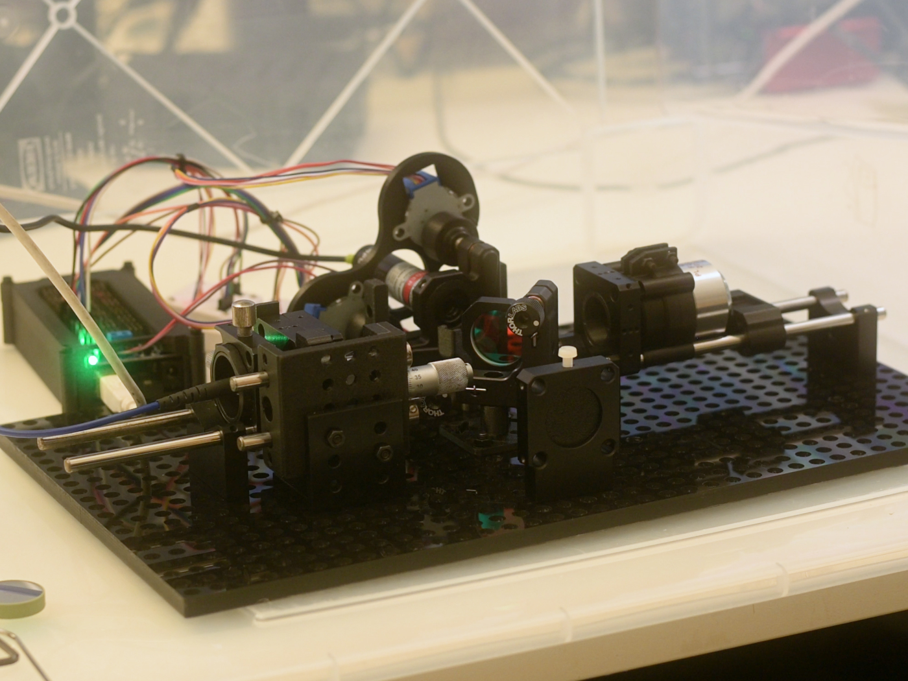
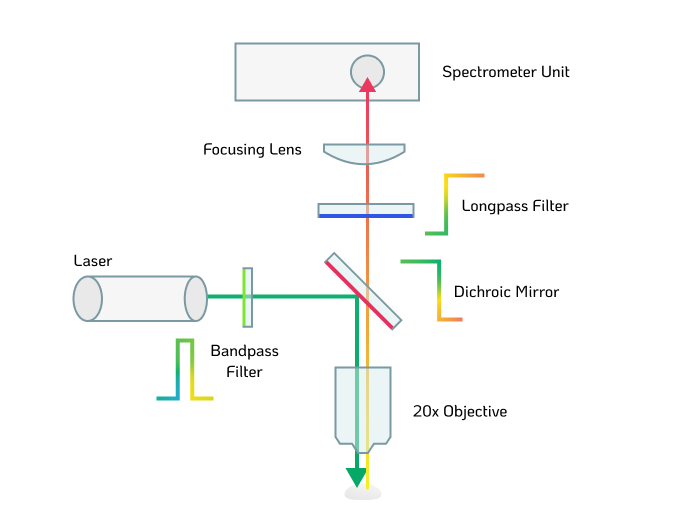
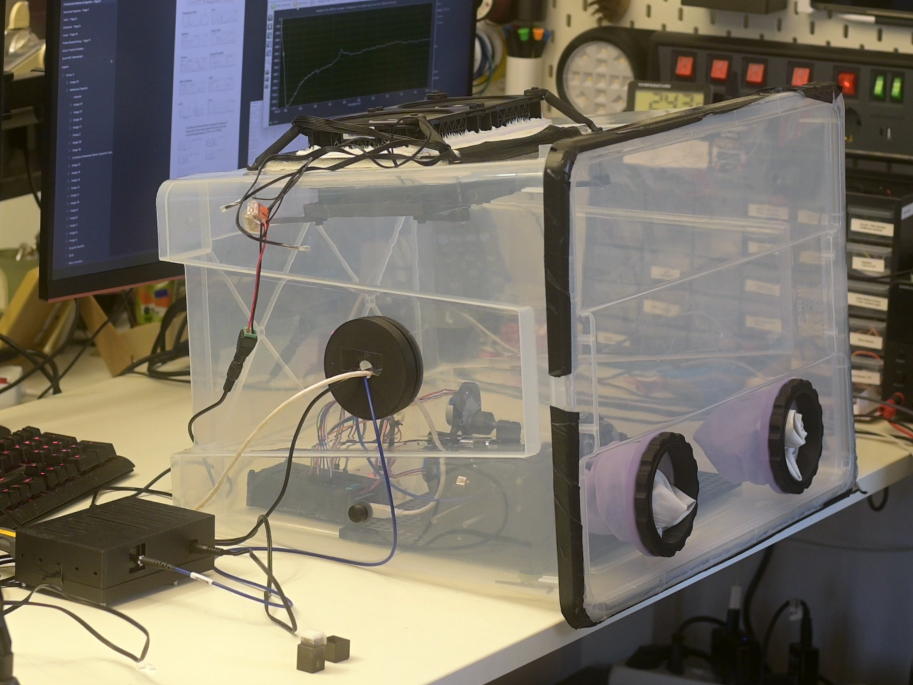

# DIYraman – Open Hardware Raman Spectrometer

  

> **Build, understand, and modify your own Raman spectrometer.**
> *A modular platform aimed at hobbyists, educators, and low-resource labs.*



---

## 🔭 Project Overview

**DIYraman** aims to make Raman spectroscopy **replicable, affordable, and fully documented**.

Raman spectroscopy allows for the identification of substances by analyzing how light interacts with molecular vibrations. Historically, this equipment costs tens of thousands of dollars. This project provides the files and instructions to bring that capability to the workbench of motivated makers and teachers.

**Key Applications**
* **Identify Substances:** Broad identification of plastics, solvents, and minerals.
* **Qualitative Screening:** Exploratory analysis of pharmaceuticals (e.g., pill composition).
* **Teach Optics:** A hands-on platform for learning spectroscopy and photonics.

> 💡 This README is a *project overview*. Detailed build instructions can be found in `docs/` and the dedicated pages: 
> [Basic Assembly](docs/instructions/Basic%20Raman%20Optical%20Assembly.md) | [Glove Box](docs/instructions/Overpressure%20Glove%20Box.md) | [Spectrometer Unit](docs/instructions/Spectrometer%20Unit.md) | [Linear Stage](docs/instructions/Linear%20Translation%20Stage.md) | [Full Assembly](docs/instructions/Full%20Raman%20Optical%20Assembly.md)

---

## ⚙️ The Hardware Architecture

To balance cost with performance, DIYraman uses a "hybrid" approach: Professional filtering optics combined with repurposed spectroscopy hardware and 3D-printed mechanics.



### The Stack
* **Spectrometer:** Surplus B&W Tek module (repurposed from eBay).
* **Excitation:** Cost-effective 532nm DPSS laser pointer.
* **Mechanics:** Fully 3D-printable modular stages and enclosures.
* **Critical Optics:** High-quality dichroic mirrors and filters (Thorlabs/Edmund Optics) are used to ensure signal integrity.

**Bill of Materials**
A detailed cost breakdown and parts list is available in the [**Bill of Materials (BOM)**](/bom/BOM%20(Bill%20of%20Materials).md).

---

## 🚀 Progress & Build Guide

The following build path is recommended to gradually increase the complexity and capability of the setup. This table reflects the current development status of the project modules.

| Step  | Module                                                                        | Description                                                              | Status     |
| :---- | :---------------------------------------------------------------------------- | :----------------------------------------------------------------------- | :--------- |
| **1** | [**Spectrometer Unit**](docs/instructions/Spectrometer%20Unit.md)             | Setup and testing of the B&W Tek sensor module.                          | 🟡 WiP     |
| **2** | [**Glove Box**](docs/instructions/Overpressure%20Glove%20Box.md)              | Enclosure construction to keep optics dust-free and ensure laser safety. | ✅ Ready    |
| **3** | [**Basic Assembly**](docs/instructions/Basic%20Raman%20Optical%20Assembly.md) | Alignment of the backscattering path. **Goal: First rough spectrum.**    | ✅ Ready    |
| **4** | [**Linear Stage**](docs/instructions/Linear%20Translation%20Stage.md)         | Addition of fine focus control for precise measurements.                 | 🟡 WiP     |
| **5** | [**Full Assembly**](docs/instructions/Full%20Raman%20Optical%20Assembly.md)   | Motorization and final integration.                                      | 🟠 Draft   |
| **6** | **Software / GUI**                                                            | Custom acquisition and visualization software.                           | 🔴 Planned |


> **Status Key:** ✅ = Verified & Documented | 🟡 = Usable, Docs in Progress | 🟠 = Draft / Unstable | 🔴 = Planned / Unpublished

---

## 📊 Technical Capabilities

| Feature | Specification |
| :--- | :--- |
| **Spectral Range** | Stokes region > ~600 cm⁻¹ |
| **Sample Type** | Solids & Liquids (Cuvette holder) |
| **Resolution** | Dependent on B&W Tek module variant |
| **Safety** | Enclosed optical path (Laser Class 3B precautions required during alignment) |



> 🧪 **Drug / counterfeit screening**  
> The system can be used for *exploratory, educational* screening of unknowns (e.g. counterfeit pills) but **must not** be treated as a validated forensic tool. **Always cross-check with certified methods!**

---

## 📂 Repository Structure

```text
├── assets/                 # Images, infographics, and media
├── bom/                    # Bill of Materials lists
├── docs/                   # Detailed build instructions
├── parts/                  # STL and CAD files for 3D printing
│   ├── basic-assembly/
│   ├── glovebox/
│   └── ...
├── results/                # Early example spectra captured
└── software/               # Acquisition software (Coming Soon)
```

---

## 🤝 Contributing

Contributions are welcome from makers, scientists, and coders. Areas for contribution include:

1. **Testing:** Reporting unclear steps or missing files in the documentation.
2. **Design:** Proposing improved mechanical mounts or variants.
3. **Coding:** Assisting with the upcoming GUI/Firmware.
4. **Sharing:** Submitting example spectra.

**Citation** If utilizing DIYRaman for research or teaching, please cite the project:

> **DIYRaman - Open Hardware Raman Spectrometer (GitHub)** 
> _Jacob Busshart, DIYraman.com_

---

## 📜 Licenses

A modular licensing structure is used to ensure maximum freedom for hardware and software usage.

- **Hardware (CAD, Schematics):** [[]][CERN-OHL-S v2](https://www.google.com/search?q=LICENSES/CERN_OHL_S_V2.txt)
- **Documentation (Guides, Images):** [CC BY-SA 4.0](https://www.google.com/search?q=LICENSES/CC-BY-SA-4.0.txt)
- **Software (Firmware, GUI):** [MIT License](https://www.google.com/search?q=LICENSES/MIT.txt)

---

### Acknowledgements

_Built on the shoulders of the open science community._

- [OpenRaman.org](https://www.open-raman.org/) & [ThePulsar.be](https://www.thepulsar.be/article/diy-raman-spectroscopy/)
- [PhysicsOpenLab.org](https://physicsopenlab.org/2022/04/22/backscattering-raman-system/)
- [LaserPointerForums Community](https://laserpointerforums.com/threads/b-w-tech-spectrometer-473-module-setup-mods-info.101467/)


---

*NOTE: Some parts of the written documentation have been formatted or translated using AI.*

