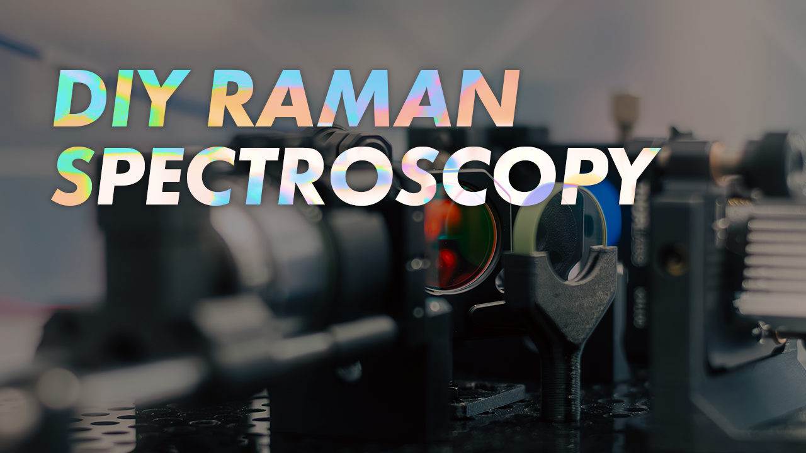
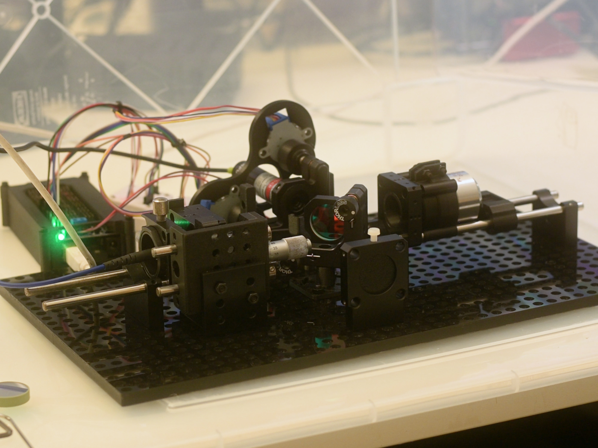
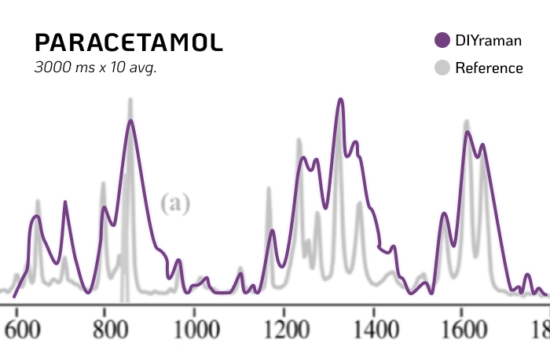
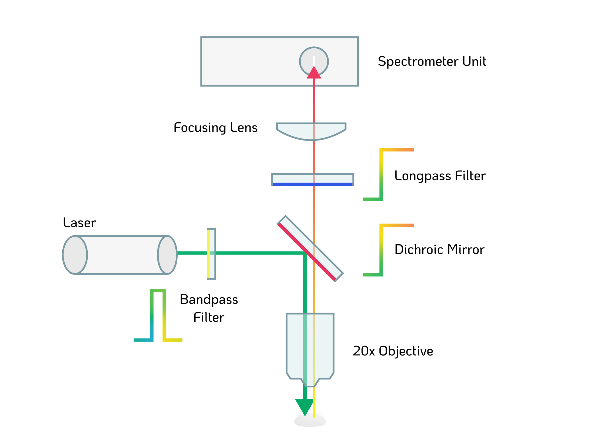
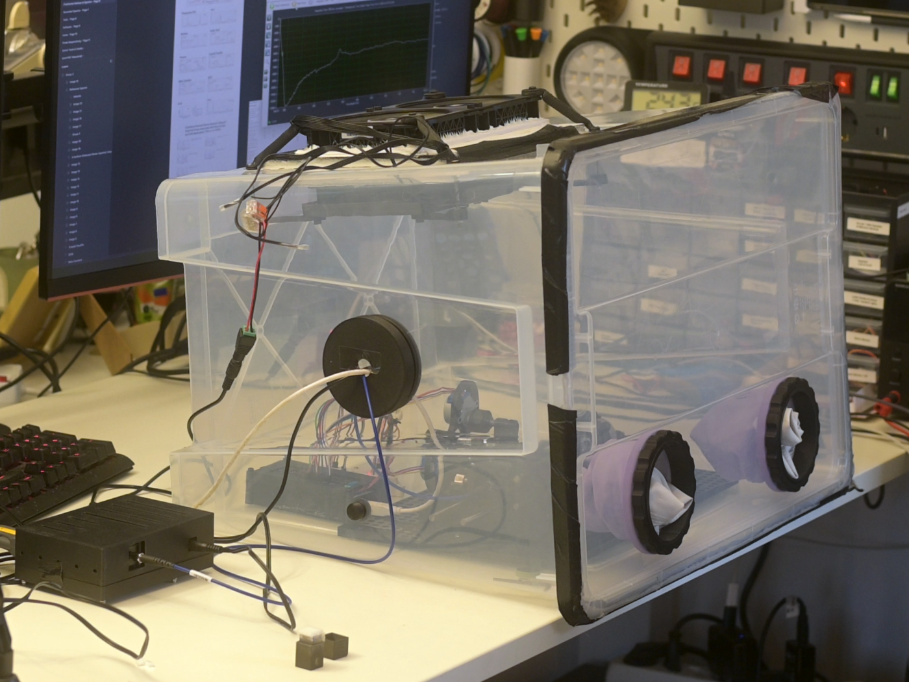

# DIYraman – Open Hardware Raman Spectrometer

  

**Build, understand, and modify your own Raman spectrometer.**
*A modular platform aimed at hobbyists, educators, and low-resource labs.* 

[docs.diyraman.com](https://docs.diyraman.com)
## Introduction

[**Click here to watch the Youtube video!**](https://www.youtube.com/watch?v=EOOmlQH1UKw)

Watch the Youtube video to get started and learn about the principles of Raman Spectroscopy, a build overview, along with part considerations, challenges, limitations and practical decisions.  

---

## Project Scope

**DIYraman** aims to make Raman spectroscopy **replicable, affordable, and fully documented**.

Raman spectroscopy allows for the identification of substances by analyzing how light interacts with molecular vibrations. Historically, this equipment costs tens of thousands of dollars. This project aims to provide instructions for interested tinkerers, who are looking for a documented, applicable build. 

**Key Applications**
* **Identify Substances:** Broad identification of plastics, solvents, and minerals.
* **Qualitative Screening:** Exploratory analysis of pharmaceuticals (e.g., pill composition).
* **Teach Optics:** A hands-on platform for learning spectroscopy and photonics.

> 💡 This README is a *project overview*. Detailed build instructions are available on **[docs.diyraman.com](https://docs.diyraman.com)** or can be found in `docs/` on the dedicated pages. An overview of the build instructions can be found further down under [Build Overview](#Build%20Overview).

---

## Component Selection

To balance cost with performance, DIYraman uses a "hybrid" approach: Professional filtering optics combined with repurposed spectroscopy hardware and 3D-printed mechanics.

* **Spectrometer:** Surplus BTC100-2S unit (available on [eBay](https://www.ebay.com/itm/143989529085))
* **Excitation:** Cost-effective 532nm DPSS laser pointer
* **Mechanics:** Fully 3D-printable modular stages and enclosures
* **Critical Optics:** High-quality dichroic mirrors and filters (Thorlabs/Edmund Optics) are used to ensure signal integrity.
	* Thorlabs Longpass Dichroic Mirror [DMLP550](https://www.thorlabs.com/item/DMLP550)
	* Thorlabs Longpass Filter [FELH0550](https://www.thorlabs.com/item/FELH0550)

**Bill of Materials**
A detailed cost breakdown and parts list is available in the [BOM (Bill of Materials)](bom/BOM.md) .

---

## Build Overview

The following build path is recommended for a complete and coherent build-experience. The table reflects the current development status of the project's modules. Best viewed and navigated by visiting the [docs.diyraman.com](docs.diyraman.com) page!

*Please note that at this point in time the reproducibility has not been externally validated, as I'm working on the next iteration to optimize and facilitate the entire setup. Until then, view this project as a documentation of my journey into DIY Raman spectroscopy.*

| Step  | Module                                                                                                                                                                                    | Description                                                                  | Status         |
| :---- | :---------------------------------------------------------------------------------------------------------------------------------------------------------------------------------------- | :--------------------------------------------------------------------------- | :------------- |
| **0** | **[Introduction](docs/Introduction.md)**                                                                                                                                                  | How all the parts work and why they were chosen.                             | 🟡 Unpolished  |
| **1** | **[Spectrometer-Setup](docs/Spectrometer-Setup.md)**  + [SpectrumStudio-Cheatsheet](docs/SpectrumStudio-Cheatsheet.md) + [Align-with-Fluorescence](docs/Align-with-Fluorescence.md) | Setup and testing of the B&W Tek spectrometer.                               | ✅ Ready        |
| **2** | **[Dustproof-Workspace](docs/Dustproof-Workspace.md)**                                                                                                                                    | DIY overpressure glovebox construction to keep optics dust-free.             | ✅ Ready        |
| **3** | **[Core-Assembly](docs/Core-Assembly.md)**                                                                                                                                                | Essential optical assembly to acquire first Raman spectra.                   | ✅ Ready        |
| **4** | **[DIY-Linear-Stage](docs/DIY-Linear-Stage.md)**                                                                                                                                          | DIY build of a low-cost linear translation stage for fine focus adjustments. | 🟡 WiP         |
| **5** | Full-Build                                                                                                                                                                                | Motorization and integration of Linear Stage.                                | 🔴 Unpublished |
| **6** | Software / GUI                                                                                                                                                                            | Custom acquisition and visualization software.                               | 🔴 Unpublished |

> **Status Key:** ✅ = Verified & Documented | 🟡 = Usable, Docs in Progress | 🟠 = Draft / Unstable | 🔴 = Planned / Unpublished

---

## Capabilities

| Feature            | Specification                                                                                 |
| :----------------- | :-------------------------------------------------------------------------------------------- |
| **Spectral Range** | Stokes region > ~600 cm⁻¹                                                                     |
| **Sample Type**    | Solids & Liquids (Cuvette holder)                                                             |
| **Resolution**     | estimated 35 cm⁻¹ (dependent on spectrometer input slit / sensor & laser beam quality)        |
| **Safety**         | Wear laser safety protection during alignment or until the optical path is entirely enclosed! |

> 🧪 **Drug / counterfeit screening**  
> The system can be used for *exploratory, educational* screening of unknowns (e.g. counterfeit pills) but **must not** be treated as a validated forensic tool. **Always cross-check with certified methods!**

---

## Repository Structure

- `docs/` — the build instructions hosted on [docs.diyraman.com](docs.diyraman.com)
- `bom/` — BOM tables and sourcing notes  
- `parts/` — files for printing / 3d-models (.stl)  */feel free to contact me for the full Fusion (.F3D) project file*
- `assets/` — all images, diagrams, misc. media  
- `results/` — example spectra / early outputs  
- `software/` — acquisition and post-processing software (unreleased, planned)

---

## Contributing

Contributions are welcome from makers, scientists, and coders. Areas for contribution include:

1. **Testing:** Reporting unclear steps or missing files in the documentation.
2. **Design:** Proposing improved mechanical mounts or variants.
3. **Coding:** Assisting with the upcoming GUI/Firmware.
4. **Sharing:** Submitting example spectra.

**Citation:** If utilizing DIYRaman for research or teaching, please cite the project:

> **DIYRaman - Open Hardware Raman Spectrometer (GitHub)** 
> _Jacob Busshart, DIYraman.com_

---

## Licenses

A modular licensing structure is used to ensure maximum freedom for hardware and software usage.

- **Hardware (CAD, Schematics):** [CERN-OHL-S v2](LICENSES/CERN_OHL_S_V2.txt)
- **Documentation (Guides, Images):** [CC BY-SA 4.0](LICENSES/CC-BY-SA-4.0.txt)
- **Software (Firmware, GUI):** [MIT License](LICENSES/MIT.txt)

---

### Acknowledgements

_Built on the shoulders of the open science community._

- [OpenRaman.org](https://www.open-raman.org/) & [ThePulsar.be](https://www.thepulsar.be/article/diy-raman-spectroscopy/)
- [PhysicsOpenLab.org](https://physicsopenlab.org/2022/04/22/backscattering-raman-system/)
- [LaserPointerForums Community](https://laserpointerforums.com/threads/b-w-tech-spectrometer-473-module-setup-mods-info.101467/)

---

*NOTE: Some parts of the written documentation have been formatted or translated using AI.*

