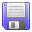
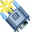
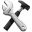
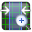
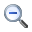
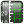

# Spectrum Studio – Quick Reference

This page summarizes the most important controls in Spectrum Studio and what they do.
It’s meant as a “how do I use this in practice?” cheat-sheet.

---

## 1. File Menu

| Icon | Menu item | What it does |
|------|-----------|--------------|
|  | **File → Open…** | Opens a previously saved spectrum file (CSV) into a **new tab**. |
|  | **File → Save As…** | Saves the **current spectrum** as CSV (with date/time, integration time, averages, and columns for pixel, wavelength, sum, average, background). |
|  | **File → Print / Print Preview / Print Setup** | Prints the current graph, shows a preview, or lets you adjust margins/orientation.  Shortcuts: **Ctrl+P** (Print), **Ctrl+S** (Save). |

---

## 2. Spectrometers Menu

| Icon | Menu item | What it does |
|------|-----------|--------------|
|  | **Spectrometers → Detect Spectrometers** | Closes all existing spectrometer tabs, scans all serial ports, and opens one tab per spectrometer found. Use this after plugging in a device or changing COM ports. |

---

## 3. Spectrometer Control Toolbar

These icons live at the top of each spectrometer tab.

| Icon                                                           | Control                                       | What it does                                                                                                                                                                                                                                                           |
| -------------------------------------------------------------- | --------------------------------------------- | ---------------------------------------------------------------------------------------------------------------------------------------------------------------------------------------------------------------------------------------------------------------------- |
|                                  | **Scan Continuously** (F4)                    | Starts continuous acquisition. As soon as one scan finishes (including averaging & transfer), the next one starts. Use this for **live** spectra.                                                                                                                      |
|                                      | **Scan Once** (F5)                            | Takes **one single spectrum** with the current integration time and averages, then stops.                                                                                                                                                                              |
|                                               | **Stop Scan** (F6)                            | Stops after the **current scan** finishes. If you requested a long averaging sequence, it will still finish the current spectrum and then stop.                                                                                                                        |
|                              | **Set Current Scan as Background**            | Uses the **currently displayed spectrum** as the background. This background is subtracted from all future averaged spectra. Immediately after doing this, the plot will be ~zero everywhere (spectrum – itself).                                                      |
|                              | **Clear Background / Set Background to Zero** | Resets the background to all zeros → effectively **disables background subtraction**.                                                                                                                                                                                  |
|   | **Log Data**                                  | Toggles **data logging**. Red / “streaming” icon = logging enabled; grey / “no stream” icon = logging disabled. Logging settings (file path, one-file-per-spectrum vs multi-line) are configured under **Options → Data Logging**.                                     |
|                         | **Change Wavelength Calibration**             | Opens the polynomial wavelength calibration dialog. You can edit or reset the λ(p) = C₀ + C₁·p + C₂·p² + C₃·p³ coefficients. Use this to switch between **wavelength mode** and **pixel mode** (C₀=0, C₁=1, C₂=0, C₃=0), or to fine-tune calibration from known lines. |

### Text fields

- **Integration Time textbox**  
  - Exposure in **milliseconds**, valid range **50–65000 ms**.  
  - Changing it mid-scan: the current scan finishes with the old time, then the new value is used.

- **Averages textbox**  
  - Number of spectra the **PC averages** before displaying/logging one result (1–1,000,000,000).  
  - Higher = smoother but slower updates.

---

## 4. Graph Interaction Toolbar (Navigation & Zoom)

These control how you move around the plot.

| Icon | Mode | What it does |
|------|------|--------------|
|  | **Default (Pointer)** | Normal mode. Lets you move the **cursors** on the graph and interact normally. |
|  | **Pan** | Click and drag to move the view around (both axes).  Shortcut: **hold Ctrl** over the graph to temporarily pan; release Ctrl to go back to pointer. |
|  | **Zoom X & Y** | Drag a rectangle to zoom into that region on **both axes**.  Shortcut: **hold Shift** over the graph to temporarily use this; while Shift is held, a **single left-click** zooms into that point. |
|  | **Zoom X** | Rectangle zoom that affects **only the X-axis** (wavelength/pixel). |
|  | **Zoom Y** | Rectangle zoom that affects **only the Y-axis** (intensity). |
|  | **Zoom Out** | Steps back through previous zoom levels.  Shortcut: **right-click** on the graph. |

---

## 5. Graph Options & Cursors

| Icon | Option | What it does |
|------|--------|--------------|
|  | **Cursors / Line Identification** | Enables visual **cursors**:  • A vertical cursor for identifying line positions; the right-hand panel shows a list of **possible spectral lines** at that wavelength (using the enabled line databases). You can tick lines to label them on the graph.  • A horizontal cursor for comparing **intensities** of widely separated peaks by aligning them to the same Y-level. |
|  | **Vertical Scale** | Toggles between **linear** and **logarithmic** intensity scale on the Y-axis. |
|  | **Background Spectrum** | Quickly manage a background to subtract from the live spectrum (set/clear). Same concept as the background buttons on the main toolbar. |

---

## 6. Program Options (Options → Program Options)

| Icon                                  | Tab                           | What it controls                                                                                                                                                                                                                                                         |
| ------------------------------------- | ----------------------------- | ------------------------------------------------------------------------------------------------------------------------------------------------------------------------------------------------------------------------------------------------------------------------ |
|  | **Data Logging**              | Sets how logging works when the **Log Data** button is active:  • Single file vs one file per spectrum.  • File path and file name template.  If the path is invalid or the target file is not writable, logging is automatically disabled.                     |
| *(no icon)*                           | **Spectral Lines Identifier** | Enables/disables line lists (elements, molecules, ionization states) for the line-identification feature. Uses CSV files in the `Lines/` directory (wavelength, ionization state, relative strength 0–100) based on NIST data. You can add your **own line lists** here. |
|                                       |                               |                                                                                                                                                                                                                                                                          |

---

## 7. Serial Command Reference (for your own code)

If you talk directly to the spectrometer over RS-232, these are the core commands.
Default serial settings: **9600 baud, 8N1, no flow control**.

| Command | Meaning | Notes |
|---------|---------|-------|
| `A{n}` | Set **hardware averaging** to `n` scans | Spectrum Studio usually leaves this at 1 and averages on the PC, because the spectrometer can’t communicate while averaging. |
| `?A` | Query hardware averaging | Returns current scan-averaging count on the device. |
| `I{ms}` | Set **integration time** in ms | Valid range **50–65000**. Example: `I75`. |
| `?I` | Query integration time | Returns current integration time in ms. |
| `K{code}` | Set **baud rate** | Codes: `7=600`, `6=1200`, `5=2400`, `4=4800`, `3=9600`, `2=19200`, `1=38400`, `0=115200`. Factory default is 9600 (`K3`). |
| `?K` | Query baud rate | Returns the current baud-rate code. |
| `Q` | Reset to **factory defaults** | Resets baud, integration time, averaging, and other settings stored in the spectrometer. |
| `S` | Start scan | Acquires one spectrum and sends 2048 data points, either ASCII or binary depending on mode. |
| `a` | ASCII mode | Spectra are returned as human-readable intensity values, one per pixel. Easier to debug, slower. |
| `b` | Binary (delta-compressed) mode | Sends signed deltas plus occasional full 16-bit values; much faster and more compact. Requires decoding in your software. |
| `?a` | Query ASCII/binary mode | Tells you whether `a` or `b` is currently active. |

---

## 8. Minimal Working Workflow

1. **Detect spectrometers**  
   Use  and open the correct tab.

2. **Set integration time & averages**  
   - Adjust integration time so peaks are high but not saturated.  
   - Increase averages if the signal is noisy.

3. **Set a background**  
   - Cover or block the input (dark).  
   - Take a scan and hit the background icon (or background button).  
   - All future spectra are now **background subtracted**.

4. **Calibrate wavelength (optional but recommended)**  
   - Record a spectrum of a lamp (e.g. CFL/neon).  
   - Use **Settings**  to adjust C₀…C₃ so known lines fall at the right wavelengths.

5. **Use cursors + zoom**  
   - Navigate with , , , etc.  
   - Use  to read precise line positions and label them.

6. **Log data when needed**  
   - Configure logging under **Options → Program Options → Data Logging**.  
   - Toggle logging with  / .

---

*Place this Markdown file in the same folder as the extracted Spectrum Studio icons (`Play.png`, `ZoomXY.png`, etc.) so the images render correctly in Obsidian, MkDocs, or GitHub.*
