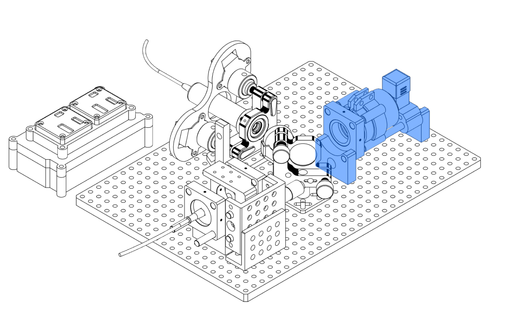
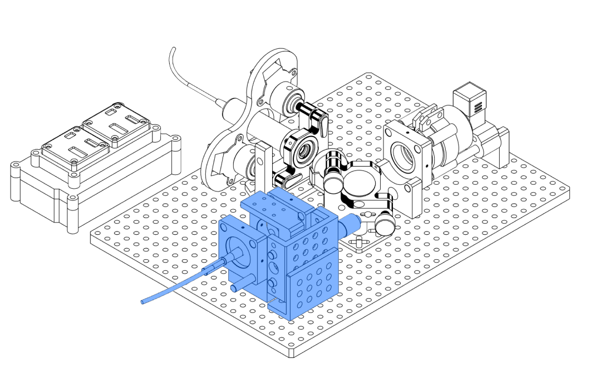
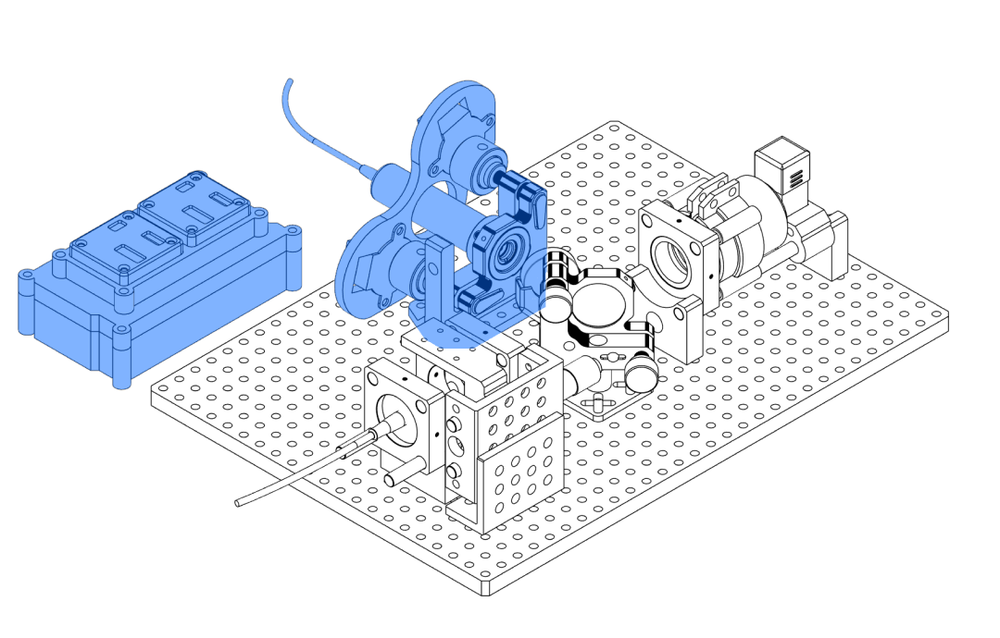
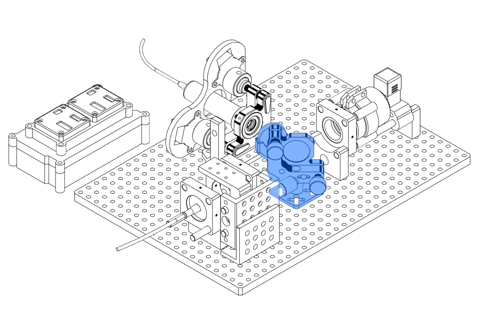

## Pre-Requisites: 

- [Linear Translation Stage](Linear%20Translation%20Stage.md)
- [Overpressure Glove Box](Overpressure%20Glove%20Box.md)
- Spectrometer Unit Case

--------------------------
EXPORT FROM FUSION DRAWING WITHOUT LINEWEIGHTS!

SUB ASSEMBLIES MIT LINEWEIGHT ON UND SHADING
## Kurzerklärung/Übersicht der essenziellen / funktionalen Komponenten vorweg!!

Lorem ipsum

--------------------------

## Sub-Assemblies

|   **"Sample Assembly"** |   **"Focusing Assembly"** |
| ----------------------------------------------------------------------------------------------------------------------- | --------------------------------------------------------------------------------------------------------------------------- |
|                                                                                                                         |                                                                                                                             |
|   **"Laser Assembly"**   |   **"Dichroic Assembly"** |

dw