# Rhodamine B Fluorescence Reference Cuvette

A dilute Rhodamine B solution is the **standard alignment sample** for the Raman optical assembly: if you cannot get a strong Rhodamine B signal, you will not be able to acquire a Raman signal from anything else.   

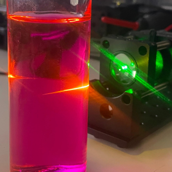  
*Oversaturated Rhodamine B solution excited with a laser. The bright orange path reveals the laser's beam path.*

**The fluorescent reference cuvette is used to:**
- **Visualise the laser** – the beam path and focal point become clearly visible in orange.  
- **Verify the optics** – confirms that objective, mirrors and coupling are aligned.  
- **Check the filters** – the 532 nm line should be strongly suppressed while orange/red fluorescence passes.

> [!INFO] Reminder  
> This uses the same printed cuvette holder as the [Basic Raman Optical Assembly](Basic%20Raman%20Optical%20Assembly.md#Sample%20Assembly).  
> For alignment you **do not** need a calibrated standard: a faintly pink, transparent solution is enough. Concentration only needs to be **roughly** in the right range.

---

## Parts and Materials

### Printed parts

| Qty | Part name (.stl)     | Used with                                                                  |
| --- | -------------------- | -------------------------------------------------------------------------- |
| 1×  | `Kuvettecase_Top`    | [Sample Assembly](Basic%20Raman%20Optical%20Assembly.md#Sample%20Assembly) |
| 1×  | `Kuvettecase_Bottom` | [Sample Assembly](Basic%20Raman%20Optical%20Assembly.md#Sample%20Assembly) |

### Sourced parts

| Qty | Item                                | Notes                                                                                         |
| --- | ----------------------------------- | --------------------------------------------------------------------------------------------- |
| 1×  | Rhodamine B / fluorescent dye       | Any strong fluorescent dye with excitation near 532 nm; instructions here assume Rhodamine B. |
| 1×  | Cuvette                             | Standard spectroscopic cuvette, compatible with the printed holder.                           |
| 1×  | Small glass container               | For the initial stock solution.                                                               |
| 1×  | Pipette or syringe (1–5 mL)         | For transferring and diluting the solution.                                                   |
| –   | Distilled / deionised water         | Solvent. Ethanol is also possible.                                                            |
| –   | PPE (gloves, goggles, lab coat)     | **Mandatory** for safe handling.                                                              |
| –   | Paper towels / wipes                | For immediate cleanup of spills.                                                              |
| –   | Dark glass bottle / vial (optional) | For storing a small batch light-protected for a few days.                                     |

---

## Preparation – Step-by-Step with Images

Rhodamine B solutions slowly degrade and can adsorb onto container and cuvette walls. For alignment it is best to prepare a small batch fresh and use it over a few days (stored dark and cool).

If you own multiple cuvettes, **designate one** as the “fluorescence cuvette” to avoid trace contamination of later Raman samples.

> [!DANGER] Hazardous substance – permanent staining and eye damage  
> Rhodamine B can permanently and irreversibly stain skin, work surfaces and fabrics, and is harmful to eyes and mucous membranes.  
> - [Read the SDS](https://www.sigmaaldrich.com/DE/fr/sds/sigma/r6626) from your supplier before use.  
> - Always wear **safety goggles** and **nitrile/latex gloves**.  
> - Work on an easy-to-clean or disposable surface.  
> - Wipe spills immediately with damp disposable wipes.  
> - Wash hands and forearms thoroughly after handling, even when wearing gloves.  
> - Never touch eyes or contact lenses while working with the dye.

### 1. Make a rough stock solution (by eye)

This is sufficient for almost all users and does not require a scale.

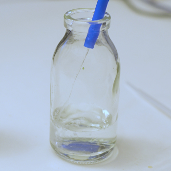

1. Fill a small glass container with about **50 mL distilled water**.

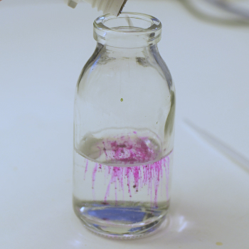

2. Lightly tap a **tiny amount** of Rhodamine B powder into the water – you want just a trace of dust until faint pink streaks appear.

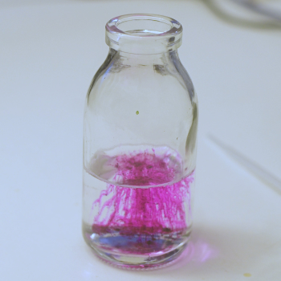

3. Swirl gently until the dye is fully dissolved. Aim for a **transparent light pink** solution – not opaque or dark.

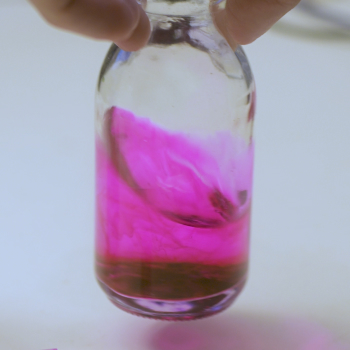

4. If solid particles remain, add a bit more water and swirl again until the solution looks homogeneous.  
   This “pink stock” is roughly in the **0.1–1 mM** range and will be diluted further.

> [!TIP] Optional precise stock (1 mM)  
> - Weigh **4.8–5.0 mg** Rhodamine B.  
> - Dissolve in **10 mL** water in a volumetric flask or cylinder → **1 mM stock**.  
> - A 1:100 dilution (0.1 mL stock + 9.9 mL water) gives a **10 µM working solution** within the 5–20 µM range.

---

### 2. Dilute to working concentration

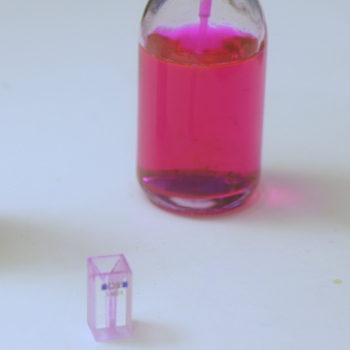

**Simple method (Single Container):**
1. Pour off some of the solution and top up with fresh water.
2. Repeat until you reach the desired dilution.

**Stock method (Two Containers):**
1. Take a small volume of your stock (e.g. **1 mL**).  
2. Add it to **20–50 mL** of clean water (≈ 1:20–1:50 dilution).  
3. Gently mix.  

> [!TIP] Visual rule of thumb  
> - Cuvette glows bright orange → good range.  
> - Everything looks like an opaque orange block, focus disappears → too concentrated → add water.  
> - Barely any fluorescence → too dilute → add a little more stock solution.

---

### 3. Fill the cuvette

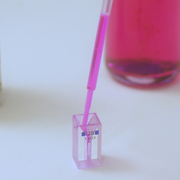

1. Use a pipette/syringe to fill the cuvette with the working solution.

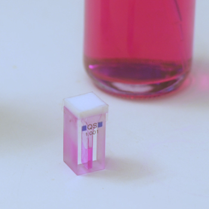

2. Fill only as much as needed to **cover the circular optical window** in the printed holder (≈ ½–⅔ full).  
3. If your cuvette has a cap, close it carefully to avoid drips.

---

### 4. Insert the cuvette into the printed holder

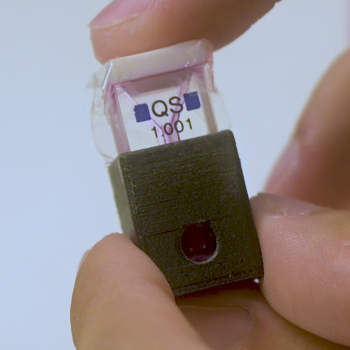

1. Slide the filled cuvette into `Kuvettecase_Bottom`.

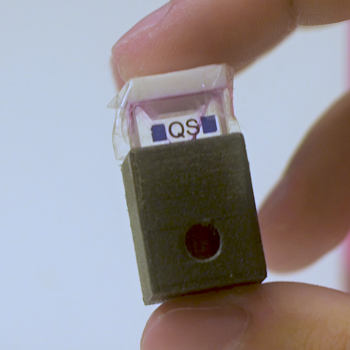

2. Gently press it down so it sits fully against the reference surface in the printed base.  
   - If the cuvette has two clear faces, make sure they face the laser input and collection optics.

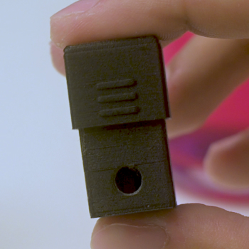

3. Slide `Kuvettecase_Top` over the base to secure the cuvette.

> [!WARNING] Keep upright  
> Always transport the assembled cuvette **upright**. Spilled Rhodamine B inside the optical assembly is difficult to remove and can permanently stain components.

---

## Optional: How to use for Alignment

Once the cuvette is mounted in the [Sample Assembly](Basic%20Raman%20Optical%20Assembly.md#Sample%20Assembly):

1. Place the cuvette holder at the objective focus (inside the cuvette, focusing its contents).  
2. Switch on the laser (at low power, if possible).  
3. From the side, verify a bright orange beam path and a clearly defined focus inside the cuvette.  
4. In the acquisition software you should see:  
   - A strong, broad fluorescence band at longer wavelengths (Stokes side).  
   - A heavily suppressed 532 nm laser line if longpass filters are correctly installed. 
1. Adjust mirror angles and focus until the fluorescence signal is strong and stable, aiming for the highest intensity value possible.

> [!TIP] Quick troubleshooting  
> - **No signal** → beam misses the cuvette or hits the plastic holder.  
> - **Strong laser line, weak fluorescence** → check filter orientation and Rhodamine B concentration.  
> - **Spectrum drifting / fading** → reduce laser power or prepare a fresh solution.

---
